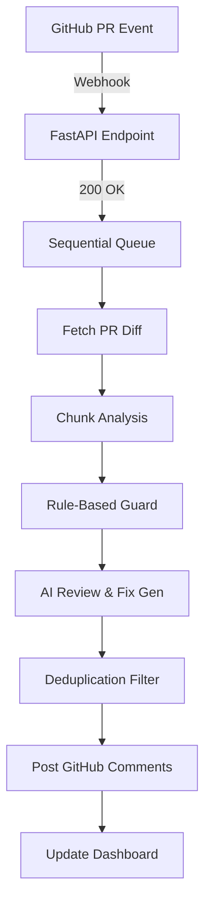

# ⚡ HCL Project: AI-Powered Pull Request Reviewer


The **HCL Project** is an AI-powered GitHub Pull Request Reviewer designed to automate code analysis and provide actionable feedback directly within the developer workflow. 

The system is built using **FastAPI** with asynchronous processing, integrated with **Groq LLMs** for semantic analysis, and uses **SQLite** for reliable state tracking. It is fully containerized with **Docker** for consistent deployment.

The review pipeline processes pull requests sequentially to ensure full diff coverage while handling API rate limits safely. A fail-safe decision system prevents unsafe approvals—any incomplete or uncertain analysis results in a `REVIEW_REQUIRED` outcome.

---

## ✨ Key Features

- **🚀 Sequential Analysis Pipeline**: Processes PRs chunk-by-chunk to ensure **100% coverage** without hitting Groq API rate limits.
- **🧠 Precise AI Feedback**: Optimized prompting eliminates false positives (e.g., ignored mitigated SQLi) and provides specific, technical remediation.
- **✨ GitHub Suggestions UI**: Automatically posts inline comments using GitHub's native ````suggestion` syntax for one-click fixes.
- **📊 Real-Time Dashboard**: Premium dark-mode Command Center with live telemetry, spectral severity metrics, and PR activity feed.
- **🛡️ Secure Guardrails**: Rule-based overrides for critical vulnerabilities (Hardcoded Secrets, RCE, etc.) ensure high-risk issues are never missed.
- **🔍 Intelligent Deduplication**: Advanced logic filters out redundant findings for the same file, line, and issue type.

---

## 🏗️ Architecture

| Layer | Technology |
|---|---|
| **Backend** | Python 3.11 + FastAPI + Uvicorn |
| **AI Engine** | Groq API (`llama-3.3-70b-versatile`) |
| **Database** | SQLite (`reviews.db`) — stores history across restarts |
| **Integration** | GitHub REST API v3 (Webhooks + Inline Comments) |
| **Container** | Docker + Docker Compose |
| **Tunneling** | `localtunnel` (for webhook testing) |

---

## ⚙️ The Review Workflow



---

## 🛠️ Setup & Running

### **Option 1: Using Docker (Recommended)**
The system is fully containerized for easy deployment.

1. **Configure Environment**:
   Create `backend/.env` with your keys:
   ```env
   GROQ_API_KEY=your_key
   GITHUB_TOKEN=your_token
   GITHUB_WEBHOOK_SECRET=907667447447
   ```

2. **Launch**:
   ```bash
   docker-compose up --build -d
   ```

3. **Access**:
   Dashboard: `http://localhost:8001/`

---

### **Option 2: Manual Run (Development)**

1. **Clone & Install**:
   ```bash
   git clone https://github.com/Shivansh1146/hcl-project
   cd "HCL Project"
   python -m venv .venv
   .\.venv\Scripts\activate
   pip install -r backend/requirements.txt
   ```

2. **Run Backend**:
   ```bash
   cd backend
   python -m uvicorn main:app --reload --port 8001
   ```

3. **Expose to GitHub**:
   ```bash
   npx localtunnel --port 8001
   ```

---

## 📁 Project Structure

```
HCL Project/
├── Dockerfile                   # Container config
├── docker-compose.yml           # Service orchestration
├── README.md                    # This file
├── vulnerable_api.py            # Test file with security bugs
├── backend/
│   ├── main.py                  # Core webhook & API logic
│   ├── stats_store.py           # Persistence & Telemetry
│   ├── reviews.db               # SQLite Data
│   ├── .env                     # Secrets (never commit!)
│   ├── static/
│   │   └── index.html           # Dashboard UI
│   └── services/
│       ├── ai_service.py        # Groq LLaMA integration
│       ├── github_service.py    # GitHub API interaction
│       ├── diff_validator.py    # Diff & Line mapping
│       └── syntax_validator.py  # Fix syntax verification
```

---

## ✅ Health & API

- **Health Check**: `GET /api/health` → `{"status": "healthy"}`
- **Telemetry**: `GET /api/stats` → Live review statistics
- **Dashboard**: `GET /` → Premium UI

---

## 👤 Author

**Shivansh**
- GitHub: [Shivansh1146](https://github.com/Shivansh1146)
- Repository: [HCL Project](https://github.com/Shivansh1146/hcl-project)

*Built with ❤️ using Python, FastAPI, and Groq.*
